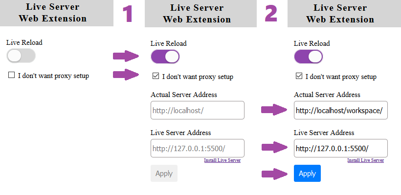

# Setup
>#### The Common Misconceptions
>Neither the browser add-on nor the VS Code extension will host a server for: `PHP`, `ASP.NET` or `NodeJS`. It will give you the *reloading function*, so you do not need to refresh the page every time you save.

<br>

***Need Help? [Watch Video Tutorial](https://www.youtube.com/watch?v=54wcX1G2GH8)***  

<br><hr>

## There are two ways to setup `Live Server Web Extension`.

1. [Direct Setup](#direct-setup) (Easy)
2. [Proxy Setup](#proxy-setup) (Advanced)

<br><hr>

## Direct Setup

1. Install [VS Code](https://code.visualstudio.com/download) from Microsoft (code editor).
2. Install VS Code [Live Server](https://marketplace.visualstudio.com/items?itemName=ritwickdey.LiveServer) (extension).
3. Install the browser add-on; [Chrome](https://chrome.google.com/webstore/detail/live-server-web-extension/fiegdmejfepffgpnejdinekhfieaogmj/) or [Firefox](https://addons.mozilla.org/en-US/firefox/addon/live-server-web-extension/).
4. Install and run a server on your machine
	+ [PHP](http://php.net/downloads.php) (just the preprocessor)
	+ [XAMPP](https://www.apachefriends.org/index.html) (cross-platform)
	+ [MAMP](https://www.mamp.info/en/downloads/) (mac)
	+ [WAMP](http://www.wampserver.com/en/) (windows)
5. Enter the neccesary fields (screenshot below)
    + **Actual Server Address:** is the address where your server is located and the port.
	+ **Live Server Address:** is the address where your VS code extension is running.
6. Push the Go Live-button in your editor.
7. Visit the `Actual Server Address`



<br><hr>

## Proxy Setup

* Install the extension on your browser.
* Install [`VSCode`](https://code.visualstudio.com/download) Editor & [`Live Server`](https://marketplace.visualstudio.com/items?itemName=ritwickdey.LiveServer) Extension.
* Confiure Live Server settings (`.vscode/settings.json`) as follows :

    ```js
    //.vscode/settings.json

    {
        // Mainly for static files
        "liveServer.settings.useWebExt": true,

        /*
            If you have dynamic pages (PHP), you have to setup proxy - it's pretty easy.

            In easy word, it means you're shifting your real url (actual PHP url)
            to another url (which LiveSever will start).
        */
        "liveServer.settings.proxy": {
            "enable": true, //switch on :)
            "baseUri": "/", //from where you want to proxy (live server).
            "proxyUri": "http://127.0.0.1:80" //the actual server url (NOT live server).
        },
    }

    ```
    * ...And you're done! Just Open Live Server _`(ctrl+shift+p > "Open Live Server")`_ and don't forget to turn on live reload from your browser.
    * Note: You have stay on the new url that will be given by Live Server.

<!-- <br>

# All available VS Code settings
```json
{
    "liveServer.settings.AdvanceCustomBrowserCmdLine": null,
    "liveServer.settings.ChromeDebuggingAttachment": false,
    "liveServer.settings.CustomBrowser": "null",
    "liveServer.settings.donotShowInfoMsg": false,
    "liveServer.settings.donotVerifyTags": false,
    "liveServer.settings.host": "127.0.0.1",
    "liveServer.settings.https": {
        "enable": false,
        "cert": "",
        "key": "",
        "passphrase": ""
    },
    "liveServer.settings.ignoreFiles": [
        ".vscode/**",
        "**/*.scss",
        "**/*.sass"
    ],
    "liveServer.settings.NoBrowser": false,
    "liveServer.settings.port": 5500,
    "liveServer.settings.proxy": {
        "enable": false,
        "baseUri": "/",
        "proxyUri": "http://127.0.0.1:80"
    },
    "liveServer.settings.root": "/",
    "liveServer.settings.useWebExt": false
}
``` -->